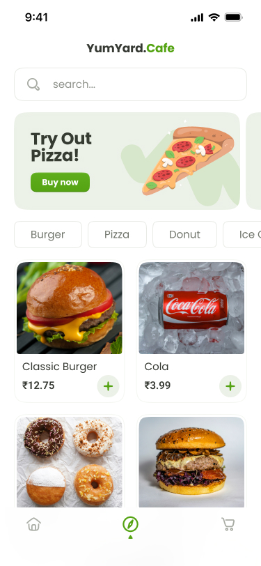
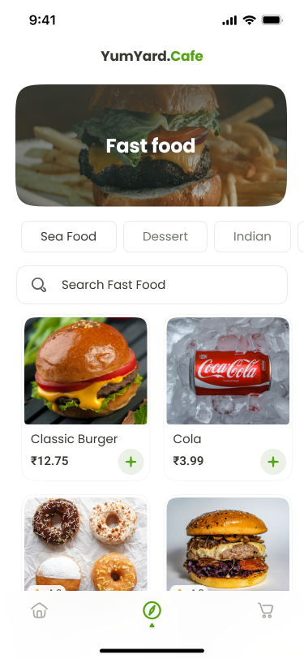
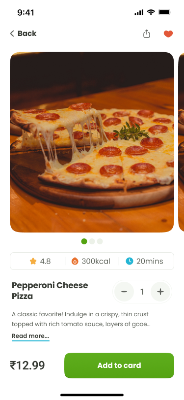
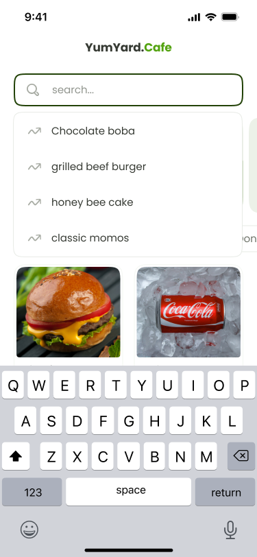
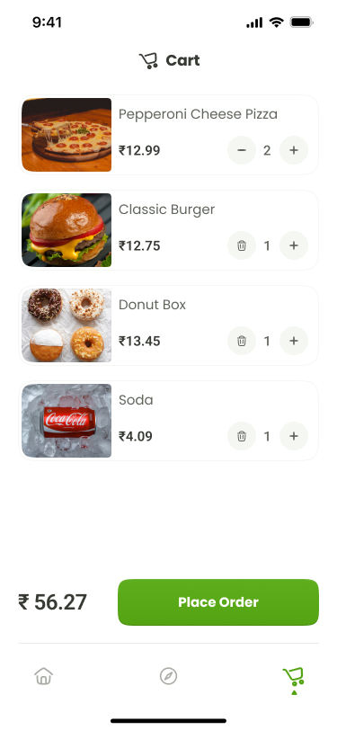

# Yumyard.Cafe

Yumyard.Cafe is a local cafe ordering app built with Next.js and Convex. Customers browse the menu and place cash-on-delivery orders, while kitchen and admin staff manage order flow through protected local dashboards.

## App Areas

- Customer menu: `/`
- Kitchen login: `/kitchen/login`
- Kitchen pages: `/kitchen/order`, `/kitchen/delivery`, `/kitchen/orderdetails`, `/kitchen/deliverydetails`
- Admin login: `/admin/login`
- Admin pages: `/admin/order`, `/admin/menu`, `/admin/editmenu`, `/admin/editorders`

Kitchen and admin routes are protected by `proxy.ts`. Login credentials are read from `.env.local`, and sessions are stored in HTTP-only cookies.

## Env Setup

- Kitchen env details: [`markdown/kitchen-env-setup.md`](markdown/kitchen-env-setup.md)
- Admin env details: [`markdown/admin-env-setup.md`](markdown/admin-env-setup.md)

Do not commit real `.env.local` values. The repo ignores `.env*` files by default.

## Design References

Figma exports are stored in `public/figma/`.

| Home | Explore | Detail |
| --- | --- | --- |
|  |  |  |

| Search | Cart |
| --- | --- |
|  |  |

## Getting Started

First, run the development server:

```bash
pnpm dev
```

Open [http://localhost:3000](http://localhost:3000) with your browser to see the result.

You can start editing the app by modifying files under `app/`. The page auto-updates as you edit files.

## Scripts

```bash
pnpm dev
pnpm build
pnpm lint
```

## Learn More

To learn more about Next.js, take a look at the following resources:

- [Next.js Documentation](https://nextjs.org/docs) - learn about Next.js features and API.
- [Learn Next.js](https://nextjs.org/learn) - an interactive Next.js tutorial.

You can check out [the Next.js GitHub repository](https://github.com/vercel/next.js) - your feedback and contributions are welcome!
